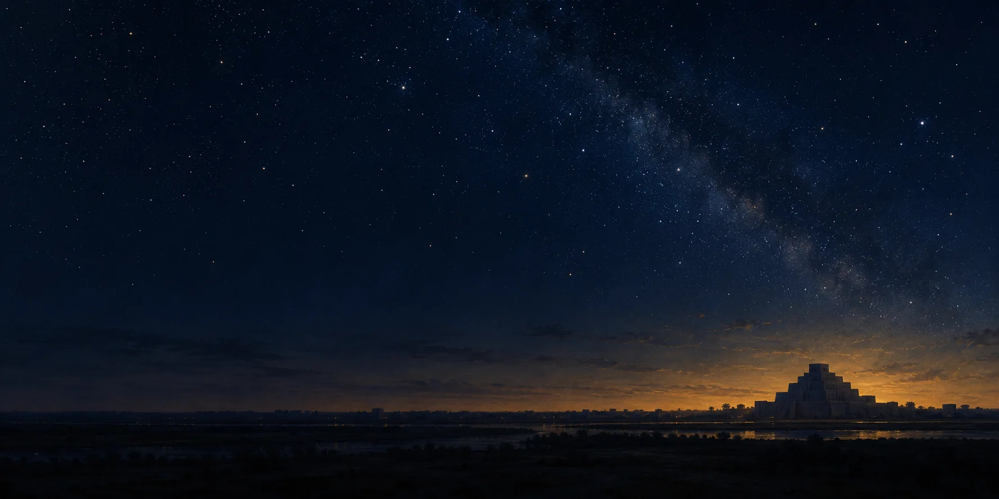

# The Sky Tablet

**From an ancient city to a sky full of questions.**

[](https://sky-tablet.vercel.app/)

[**Enter the cinematic journey →**](https://sky-tablet.vercel.app/) · [**Connect with Andrew →**](https://authority-engine-app.vercel.app/contact?source=sky-tablet&intent=collaboration&utm_source=github&utm_medium=repository&utm_campaign=sky_tablet)

Start at street level. Pass through the gate. Encounter a clay tablet, then pull back into an open sky with **MUL — “star”**, **Venus, Jupiter and Mars** and the **Three Paths**. Switch to free exploration whenever curiosity takes over.

A browser-based experiment by **Andrew Lam**, bringing together cultural history, interactive storytelling and technology. Select sound to hear the original generative score. No account required.

## What would you build from this?

A museum encounter? A learning experience? A different way to explain a difficult idea? Bring the question or the project you have in mind.

- [**Discuss a project with Andrew**](https://authority-engine-app.vercel.app/contact?source=sky-tablet&intent=collaboration&utm_source=github&utm_medium=repository)
- [**Share a research question or source**](https://authority-engine-app.vercel.app/contact?source=sky-tablet&intent=research&utm_source=github&utm_medium=repository)
- [**Stay connected on LinkedIn**](https://www.linkedin.com/in/lam-teck-sing-andrew-79886719)

If the experience interests you, **star this repository** to keep it within reach, or share the live link with someone who would enjoy exploring it.

## Current implementation

- A bounded visible-time camera clock, continuous transitions and orientation-preserving free exploration
- Wide sky framing on portrait, landscape and desktop, with MUL and three labeled planets visible together; a Wide sky shortcut
- Touch controls, with movement paused while reading the creator invitation
- Human-scale inscribed tablet with rounded edges, recessed wedge geometry and a stone display base
- Detailed tablet provenance available through Evidence lens instead of covering the cinematic reveal
- Generated photographic-style masonry textures, layered temple terraces, 52 stair treads, recessed sanctuary, parapets and roof beams
- Linen-like material response, varied skin tones, finer facial geometry and subtle breathing/head movement on nearby figures
- Directional dusk lighting, tighter shadow coverage, flickering lamps and a Temple view shortcut
- Distant point stars, a small moon and Venus, with an educational sky interpretation
- Instanced repeated geometry and bounded lighting to limit rendering overhead
- Clear routes to Andrew, JARVIS PRIME, VELYQUA, The Portal and Living Worlds

This replaces the former README’s sky wheel, synodic-cycle explorer and searchable sign-sampler description. Those are not the current interface.

## Evidence and limits

Planet positions are illustrative, not a sky chart for a particular date. MUL labels sky vocabulary, not a named astronomical object.

The scene is an interpretive software prototype, not a surveyed historical reconstruction or a date-accurate astronomical simulation. Generated textures and procedural people are not archaeological scans or photogrammetric humans. The visual target is maximum practical realism; full photorealism is not claimed.

Camera regression tests exercise the shipped camera and scene logic with real Three.js geometry/math and a stubbed renderer. They do not verify GPU appearance or physical iPhone performance. See [repair and asset provenance](docs/2026-09-16-cinematic-repair.md).

## Run and verify

Serve this directory over HTTP, then open `index.html` in a WebGL-capable browser. `experience.html` owns the scene; `index.html` hosts the experience and sound controls.

```bash
npm ci
npm test
python -m http.server 8000
```

Operational deployment identity is recorded in the portfolio’s canonical PRIME manifest, referenced by `SSOT.json`. Source changes and passing tests do not by themselves prove deployment.

Canonical portfolio record: https://github.com/AndrewLamSingapore/prime/blob/main/governance/operational-manifest.json
